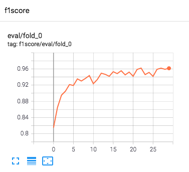

# Multichannel-Image-Classification-Pipeline

This repository is an easy to run and modify pipeline for image (RGB / RGBA / Multichannel) classification task.




### Features:

- support both common image format (jpg/png etc.) and multi-channel input (e.g. hyperspectral remote sensing image).
- format your dataset by modifying ```scripts_preprocess``` folder script, and train your model with one line command.
- display tensorboard for viewing training status.
- support K-fold cross validation, and inference by merging best model of each fold in voting or averaging way.


### Requirements:

```shell
pandas==1.1.1
torch==1.6.0
scikit-learn==0.23.1
PIL==7.2.0
```


### Startups:

To start your training, firstly prepare image datasets and labels. 

Save all training images in your customized path, and set ```TRAIN_IMAGE_DIR``` in ```basic_config.py```. Test images with no label in the similar way, and set ```TEST_IMAGE_DIR``` to your test data path. Train and test images are allowed to be in the same folder. If you are training a multi-channel (i.e. number of channels > 4) image, you should convert and save them as numpy arrays (in .npy format) by ```np.save('xxx.npy', arr)``` .

Generate train_labels.csv and test_imids.csv, train csv have at least two columns, with one column name must be ```imid``` to identify image name (without postfix)， the column name that indicate the target label is set in ```task_name``` in config.

Then, setting other parameters in your ```basic_config.py```, if you want to use pretrained model, set the pretrained model path in config as well. Model arch are the same with [timm](https://github.com/rwightman/pytorch-image-models) (multi-channel only support 'tf_efficientnet_b5_ns' now, more arches will be added in the future.)

After all settings are done, run the command to train your model!

``` sh start_train.sh ```

then you can use ```tail -f tr.log``` to view the training status.


### TODO List

- support more archs with multi-channels
- support image regression task


### Aknowledgements

Some of code in the repo is based on or modified from the following code:

https://signate.jp/competitions/431/discussions/pytorch-example-1

https://github.com/rwightman/pytorch-image-models/tree/master/timm

https://github.com/albumentations-team/albumentations

