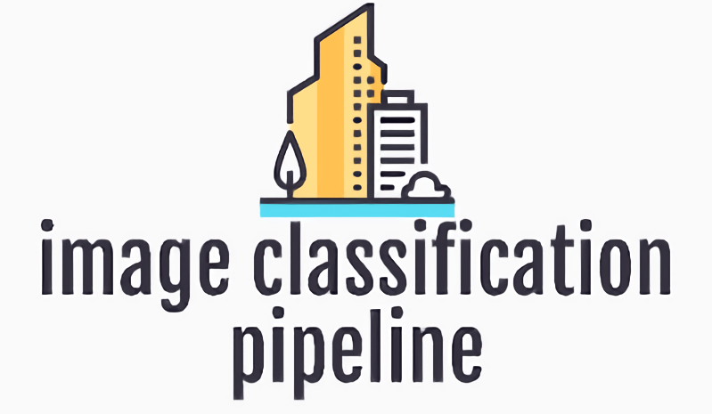

# Image-Classification-Pipeline

 

This repository is an easy to run and modify pipeline for image classification task.

Write your own yaml configuration file, or use the template yaml with modifying the dataroot and related settings, then you can run with [timm](https://timm.fast.ai/) provided networks in one line:

```python
python train_imgcls.py -opt options/train/000_csvdata_timmarch_template.yml
```

or use the bash script to run it in nohup mode:

```shell
sh start_train_imgcls.sh options/train/000_csvdata_timmarch_template.yml 0  # train logs saved in logs/train_000_0.log
```

Training logs are saved in `./tb_logger` by default, use the following commands to see the training status

```shell
nohup tensorboard --logdir tb_logger --port 8123 > tb.log 2>&1 &
tail tb.log
```

open localhost with port 8123, then


## 0x00 ChangeLog

2022.08.17  initialize codebase


## 0x01 Installation


## 0x02 Codebase Architecture
The codebase is organized as follows:

=============================================================

[archs](./archs/) : network architectures, timm based arch TimmArch is used as default.

[data](./data/)

-- [data_augment](./data/data_augment/) : augmentation functions, you can design your own aug settings

-- [simple_csv_dataloader.py](./data/simple_csv_dataloader.py) : csv file indicating label and path correspondance

-- [simple_folder_dataloader.py](./data/simple_folder_dataloader.py) : each class in each subfolder of dataroot

[losses](./losses/) : implement customized losses, pre-implemented focal_loss as example

[metrics](./metrics/) : metrics for evaluation, e.g. Acc@1, Acc@5, Macro-F1score

[models](./models/) : model class which contains data feeding, train, eval, save model, inference etc.

[options](./options/)

-- [train](./options/train/) : train configs in .yml format

-- [test](./options/test/) : test configs in .yml format (input only, and save results)

[scripts](./scripts/) : useful scripts for pre-/post-processing of datasets

[utils](./utils/) : utility functions collection

[train_imgcls.py](./train_imgcls.py) : train script which parses the config and run train/eval

=============================================================

## 0x03 Config Format Interpretation

Here we use `options/train/000_csvdata_timmarch_template.yml` as example to illustrate the format and meaning of necessary variables for the config yaml file.

```yaml
# basic settings
exp_name: ~  # empty, will be overwritten by filename when start training
model_type: BaselineModel  # corresponding to models folder (module), currently only basemodel
log_dir: ./tb_logger  # where the tensorboard logger saved
save_dir: ../exps  # where the ckpts saved
device: cuda  # cuda or cpu
multi_gpu: false # if true, use all visible gpus to train

# dataset settings
datasets:
  train_dataset:
    type: SimpleCSVDataloader  #  refer to data module to find the implemented dataloaders
    dataroot: /path/to/your/dataset  # data root for images
    csv_path: /path/to/your/train.csv  # csv file containing image path and labels
    imgpath_colname: 'image_path'  # column name referring to image path
    label_colname: 'label'  # column name referring to label
    is_append_root: true   # if csv saves only relative image path w.r.t. dataroot, set true
    augment:
      augment_type: flip_aug # augmentation type, name of data/data_augment/*.py
      size: 512 # params for augment function
    batch_size: 10
    num_workers: 4

  val_dataset: # val dataset params meanings the same as above
    type: SimpleCSVDataloader
    dataroot: /path/to/your/dataset
    csv_path: /path/to/your/val.csv
    imgpath_colname: 'image_path'
    label_colname: 'label'
    is_append_root: true
    augment:
      augment_type: flip_aug
      size: 512


train: # training settings, meaning as names
  num_epoch: 100
  model_arch:
    type: TimmArch # template only contains TimmArch, which directly implements network using timm
    load_path: ~ # if local pretrained weights are utilized
    backbone: resnet34
    num_classes: 3
    pretrained: false

  optimizer:
    type: Adam
    lr: !!float 5e-4
    weight_decay: 0
    betas: [0.9, 0.99]

  scheduler:
    type: MultiStepLR
    milestones: [80]
    gamma: 0.1

  criterion:
    type: celoss  # support celoss and focal_loss

  metric:
    type: topk_acc  # refer to module metrics
    k: 1

eval:
  eval_interval: 2  # eval model using val dataset each 2 epoches.
```


## 0x04 Dataset Preparation

### CSV Format Dataset

```
dataroot/
    img1.png
    img2.png
    ...
img_label.csv
```

### Folder Format Dataset

```
dataroot/
    class_1/
        img1_1.png
        img1_2.png
        ...
    class_2/
        img2_1.png
        ...
    ...
```

## 0x05 Customized Usage

For simple training a classification model, writing your own yml config (as shown in 0x03) is enough. But if the pre-implemented model cannot meet your requirement, you can also add/modify your own customized components in a minimal cost of development.

### add your own dataset

Write a `custom_dataloader.py` under `data` folder, and import the class in `__init__.py`, then you can select your customized dataloader classname in yml config.
Returned dict should be the same as `SimpleCSVDataset` if you still use `BaselineModel`, otherwise it is not stricted.

### add your own arch

Write a `custom_arch.py` under `archs` folder, and import the class in `__init__.py`. Then select in yml `model_arch -> type`, params to construct the arch should be passed using arguments under `load_path`.

### add your own model (to change train/eval/save/inference operations)


### add your own loss, metric etc.


